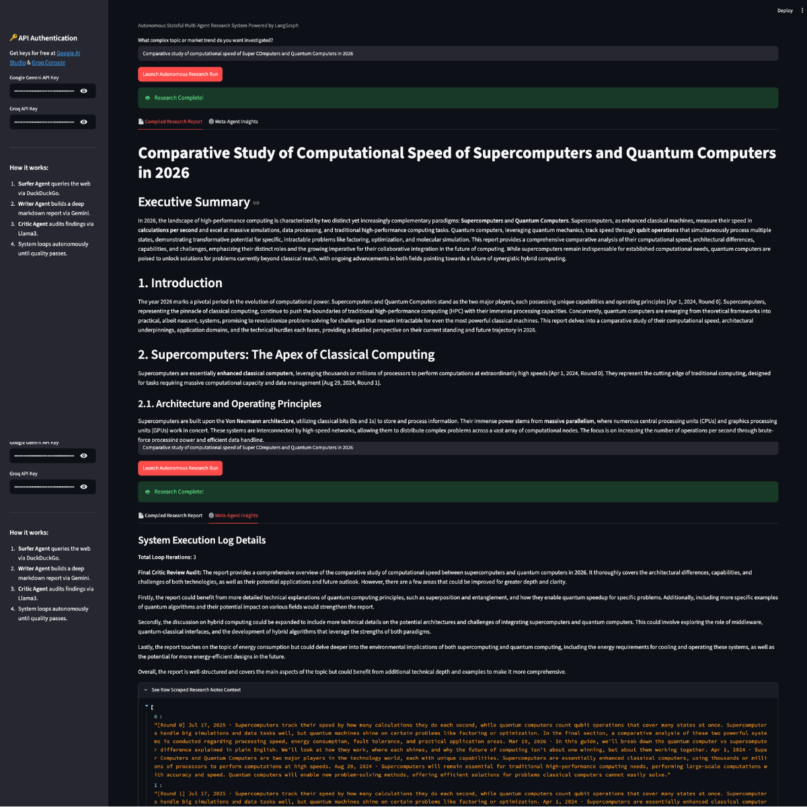
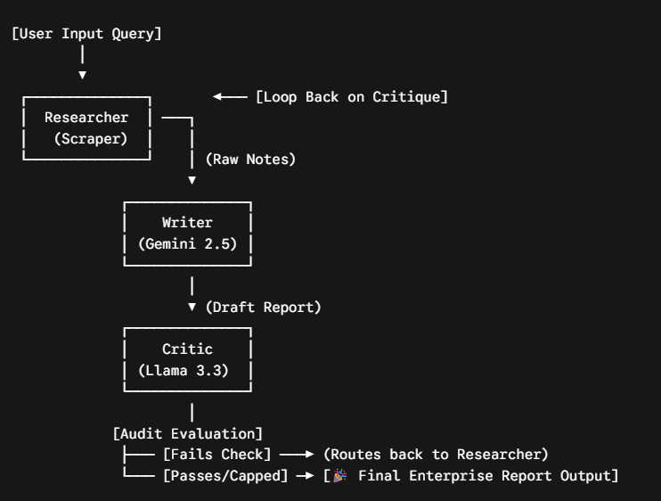

# DeepResearch-OS 🌐

An autonomous, stateful multi-agent research engine that scrapes the web, synthesizes enterprise-grade technical intelligence reports, and subjects its own outputs to human-grade quality assurance audits. Built using **LangGraph**, **Gemini 2.5 Flash**, and **Llama 3.3 (Groq)**.

<p align="center">
  
</p>

## 🚀 Key Architectural Features

- **Self-Correcting Multi-Agent Loop:** Leverages LangGraph to orchestrate a cyclic agent topology. A strict **Critic Agent** programmatically audits reports produced by the **Writer Agent**, rejecting subpar drafts and forcing the **Web Surfer Agent** into targeted, iterative web-scraping runs until quality thresholds are cleared.
- 
- **Stateful Memory Infrastructure:** Utilizes native LangGraph memory checkpointers (`MemorySaver`) to preserve explicit thread states, agent variables, and raw trace histories across complex operational feedback loops.
- 
- **Cost-Optimized Hybrid Topology:** Pairs ultra-low latency inference engines (**Groq + Llama 3.3 70B**) for swift, structured routing and critical evaluation alongside large context reasoning windows (**Google Gemini 2.5 Flash**) for parsing massive web-scraped content—running entirely on **100% Free Tiers**.

---

## 📊 Enterprise-Grade Output Generation

DeepResearch-OS does not just dump raw text. The final artifact generated by the workflow is an executive-level briefing tailored for stakeholders and engineering leaders. 

### Output Capabilities:
- **Comprehensive Structure:** Automatically parses raw, fragmented data points into clear Markdown portfolios containing an Executive Summary, Deep Architecture Deconstructions, Comparative Tables, Trade-off Analyses, and Strategic Future Outlooks.
- 
- **Grounding & Fact Integrity:** Built-in citation tracking maps back to specific agent scraping rounds, effectively mitigating LLM hallucinations during synthesis.
- 
- **Defensive Design:** Designed with hard-capped iteration loops to optimize free-tier tokens while ensuring deep informational depth before completing the run.

---

## 🛠️ Tech Stack

- **Orchestration Framework:** LangGraph (`StateGraph`)
- **Reasoning & Synthesis Model:** Google Gemini 2.5 Flash
- **Router & Critic Model:** Llama-3.3-70b-versatile (via Groq Cloud)
- **External Interfaces:** DuckDuckGo Web Scraper API Engine
- **UI Architecture Dashboard:** Streamlit Community Engine

---


## 📦 Local Installation Guide

1. Clone the project and navigate to the directory:
```bash
git clone [https://github.com/YOUR_USERNAME/deepresearch-os.git](https://github.com/YOUR_USERNAME/deepresearch-os.git)
cd deepresearch-os
```

2. Establish and source an insulated Python virtual environment:
```bash
python -m venv venv
source venv/bin/activate  # Windows: venv\Scripts\activate
```

3. Install production-ready dependency versions:
```bash
pip install -r requirements.txt
```

4. Boot up the Streamlit interface dashboard:
```bash
streamlit run app.py
```

## 🗺️ System Workflow Architecture


<p align="center">
  
</p>

## 🤝 Contributing & Open Source

DeepResearch-OS is entirely open-source and built for the community. I built this to solve a real problem with LLM hallucinations in research tasks, and I want you to use it, break it, and make it better!

You are completely free to use this code for your own personal projects, internal company workflows, or weekend hackathons. 

**Want to contribute?**
1. Fork the Project
2. Create your Feature Branch (`git checkout -b feature/AmazingFeature`)
3. Commit your Changes (`git commit -m 'Add some AmazingFeature'`)
4. Push to the Branch (`git push origin feature/AmazingFeature`)
5. Open a Pull Request

If you found this tool helpful, please give the repo a ⭐️! 

## 📜 License

Distributed under the MIT License. See `LICENSE` for more information.

